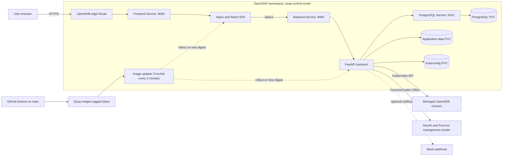

# PSAP Control Center

A cluster management and reservation platform for the Performance and Scale for AI Platforms (PSAP) team. Provides observability into OpenShift cluster health, a reservation system with calendar views, kubeconfig management, and Hearth GPU discovery integration.

Deployment URLs are environment-specific. Discover the route for an OpenShift
deployment with:

```bash
oc get route psap-control-center -n <namespace> \
  -o jsonpath='https://{.spec.host}{"\n"}'
```

## Features

- **Cluster Registry** — Add clusters via kubeconfig upload or kubeadmin credentials. Live health monitoring, node topology visualization, OCP details, operators, and workloads.
- **Reservation System** — Full-cluster or partial GPU reservations with type-aware conflict detection. Color-coded calendar, cancellation tracking, and historical preservation when clusters are removed.
- **GPU Allocation & DRA** — Live GPU status via DRA (`resource.k8s.io`) with automatic fallback to legacy node capacity counting. Per-GPU-type breakdowns, ConfigMap-driven vendor abstraction.
- **Namespace Enforcement** — GPU reservations automatically provision isolated Kubernetes namespaces with `ResourceQuota` and optional DRA `ResourceClaimTemplate`. Namespaces are cleaned up on completion, cancellation, or deletion.
- **Calendar Views** — Weekly preview with overlapping reservation display (index-based opacity for distinguishing coexisting reservations), plus full month/week/day calendar.
- **Hearth Integration** — Connect the shared Hearth/Fournos management cluster with a kubeconfig or a specific OpenShift user's credentials, then discover GPU inventory from `FournosCluster` CRDs.
- **Cost Explorer & Billing** — Compare public, estimated, and actual infrastructure costs using cluster snapshots and uploaded IBM Cloud billing reports.
- **Slack Notifications** — Configure an incoming webhook for reservation notifications from the admin settings page.
- **Role-Based Access** — Public read access, signed-in reservation workflows, and administrator-only cluster, integration, billing, and cost management.
- **Structured Logging** — Consistent log format across backend and frontend, configurable via `LOG_LEVEL`.

## Tech Stack

| Layer | Technology |
| ----- | ---------- |
| Frontend | React 18, TypeScript, Vite, Tailwind CSS, TanStack Query; served by Nginx |
| Backend | Python 3.11, FastAPI, async SQLAlchemy, Kubernetes client |
| Database | SQLite for local development; PostgreSQL in production |
| Platform | OpenShift Routes, Services, Deployments, Secrets, and persistent volumes |
| Delivery | GitHub Actions → Quay.io → in-cluster image-updater CronJob |
| Local runtime | Docker Compose or separate Vite/FastAPI processes |

## Production Architecture



The public Route terminates TLS at OpenShift and sends all traffic to Nginx.
Nginx serves the React application and proxies `/api` requests to FastAPI.
The backend stores application records in PostgreSQL and keeps uploaded or
generated kubeconfigs on a dedicated persistent volume. It uses those
kubeconfigs to query managed clusters and the Hearth/Fournos management
cluster without exposing cluster credentials to the browser.

Production delivery is pull-based: a push to `main` builds the frontend and
backend images in GitHub Actions and publishes `:latest` tags to Quay. An
in-cluster CronJob checks the image digests every two minutes and restarts only
the deployments whose digest changed. GitHub Actions does not require direct
access to the OpenShift API.

## Quick Start

### Docker Compose

```bash
git clone https://github.com/openshift-psap/psap-control-center.git
cd psap-control-center
cp .env.example .env    # Edit credentials as needed
docker compose up --build -d
```

Before starting, replace `SECRET_KEY`, `ADMIN_PASSWORD`, and `USER_PASSWORD`
in `.env`. Both the admin and user accounts are required by the backend.

- UI: http://localhost:3000
- API docs: http://localhost:8000/docs

### Local Development

```bash
# Backend
cd backend
python -m venv venv && source venv/bin/activate
python -m pip install -r requirements.txt
ADMIN_USERNAME=admin ADMIN_PASSWORD=admin \
USER_USERNAME=user USER_PASSWORD=user \
  uvicorn app.main:app --reload

# Frontend (separate terminal)
cd frontend
npm install
npm run dev
```

- Frontend: http://localhost:3000 (Vite proxies /api to :8000)
- Backend: http://localhost:8000

### OpenShift Deployment

See [deploy/README.md](deploy/README.md) for the full OCP deployment guide.

## Authentication

Authentication uses an HttpOnly JWT session cookie. Credentials are submitted
only to `/api/v1/auth/login`; API requests do not use HTTP Basic Auth.

| Role | Access |
| ---- | ------ |
| Public | View clusters, reservations, calendars, Hearth inventory, and health status |
| User | Public access plus authenticated reservation workflows |
| Admin | Full access, including clusters, approvals, Hearth, Slack, billing, and cost management |

The two accounts are configured with `ADMIN_USERNAME` / `ADMIN_PASSWORD` and
`USER_USERNAME` / `USER_PASSWORD`. Production stores them in an OpenShift
Secret. Sign in from the top-right corner of the UI; sessions last eight hours
by default.

## Configuration

| Variable | Default | Description |
| -------- | ------- | ----------- |
| `ADMIN_USERNAME` / `ADMIN_PASSWORD` | Required | Administrator account |
| `USER_USERNAME` / `USER_PASSWORD` | Required | Standard user account |
| `DATABASE_URL` | `sqlite+aiosqlite:///./psap_control_center.db` | Async SQLAlchemy connection string |
| `SECRET_KEY` | Development placeholder | JWT signing key; replace in every deployment |
| `ACCESS_TOKEN_EXPIRE_MINUTES` | `480` | Session lifetime in minutes |
| `KUBECONFIG_STORAGE_PATH` | `./kubeconfigs` | Persistent kubeconfig directory |
| `HEARTH_ENABLED` | `true` | Enable Hearth/Fournos integration |
| `HEARTH_NAMESPACE` | `hearth` | Namespace containing `FournosCluster` resources |
| `HEARTH_KUBECONFIG_PATH` | Optional | Read-only externally managed management-cluster kubeconfig |
| `BILLING_CSV_STORAGE_PATH` | `./billing_csvs` | Billing report storage directory |
| `LOG_LEVEL` | `INFO` | Backend log level: ERROR, WARN, INFO, or DEBUG |
| `MLFLOW_BASE_URL` | Optional | Reserved for the planned Results integration |
| `VITE_LOG_LEVEL` | `INFO` | Frontend build-time log level |
| `VITE_ENV_BANNER` | Optional | Frontend build-time environment banner |

## Documentation

| Document | Description |
| -------- | ----------- |
| [Architecture](docs/ARCHITECTURE.md) | System design, data model, API surface, deployment topology |
| [User Guide](docs/USER_GUIDE.md) | How to use the application |
| [Contributing](docs/CONTRIBUTING.md) | Branch workflow, code standards, PR process |
| [Troubleshooting](docs/TROUBLESHOOTING.md) | Common issues and solutions |
| [OCP Deployment](deploy/README.md) | Step-by-step OpenShift deployment guide |

## API

Interactive documentation is available at `/docs` (Swagger) and `/redoc` when the backend is running.

Key endpoints:

| Endpoint | Method | Access | Description |
| -------- | ------ | ------ | ----------- |
| `/api/v1/health` | GET | Public | Service health |
| `/api/v1/auth/login` | POST | Public | Create a session cookie |
| `/api/v1/auth/me` | GET | Signed in | Return the current session |
| `/api/v1/clusters` | GET | Public | List clusters |
| `/api/v1/clusters` | POST | Admin | Add a cluster |
| `/api/v1/clusters/{id}/topology` | GET | Public | Node topology |
| `/api/v1/clusters/{id}/gpu-status` | GET | Public | Live GPU allocation using DRA or legacy capacity |
| `/api/v1/reservations` | GET | Public | List reservations |
| `/api/v1/reservations` | POST | Signed in | Create a full-cluster or GPU reservation |
| `/api/v1/reservations/{id}/cancel` | POST | Signed in | Cancel an authorized reservation |
| `/api/v1/reservations/calendar` | GET | Public | Calendar events |
| `/api/v1/hearth/status` | GET | Public | Management-cluster connection status |
| `/api/v1/hearth/connect` | POST | Admin | Connect with a kubeconfig |
| `/api/v1/hearth/connect/credentials` | POST | Admin | Connect as a specific OpenShift user |
| `/api/v1/hearth/clusters` | GET | Public | Hearth GPU inventory |
| `/api/v1/cost-explorer/snapshots` | GET | Admin | Cost snapshots |
| `/api/v1/billing/upload` | POST | Admin | Upload a billing CSV |

See [docs/ARCHITECTURE.md](docs/ARCHITECTURE.md) for the complete API reference.

## License

[Apache License 2.0](LICENSE)

## Related Projects

- [TOPSAIL](https://github.com/openshift-psap/topsail) — Test Orchestrator for Performance and Scalability of AI pLatforms
- [Performance Dashboard](https://github.com/openshift-psap/performance-dashboard) — RHAIIS benchmark analysis
